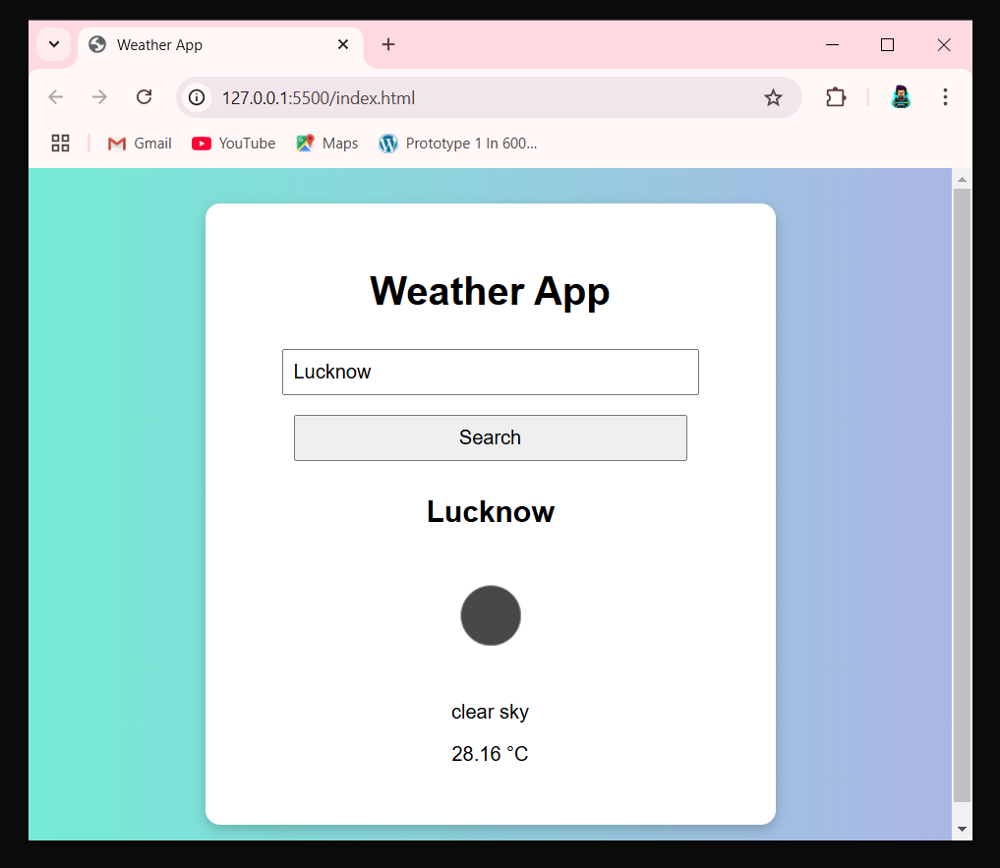

# 🌤️ Weather App

A simple and clean weather application built with **HTML, CSS, and JavaScript**, powered by the **OpenWeatherMap API**.

## 🚀 Features

- 🔍 Search weather by city name
- 📡 Real-time weather data
- 🌡️ Temperature in Celsius
- ⛅ Weather description & icon
- ❌ Error handling for invalid cities
- 📱 Responsive layout

## 🔧 Tech Stack

- HTML5
- CSS3
- JavaScript (Vanilla)
- OpenWeatherMap API

## 📦 How to Use

1. Clone the repository:
   git clone https://github.com/your-username/weather-app.git

2.Open index.html in your browser (or use Live Server in VS Code).

3.Enter a city name and click "Search".

Note: You’ll need an API key from OpenWeatherMap. Replace the apiKey variable in script.js with your own.

Demo

🧠 Author
Shanki (@shanki1001)
